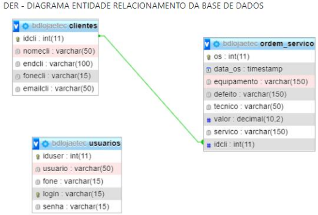

# Demonstração de criação de um projeto em JAVA com acesso à uma base de dados MySQL
Neste repositório serão incluídas todas as etapas de um sistema de controle de Ordens de Serviço com sistema de login e verificação de nível de usuário logado dentro do sistema, além de prover acesso à emissão de relatórios das ordens de serviços geradas.

